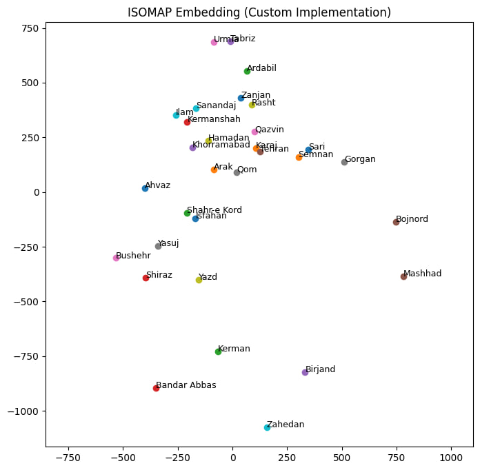
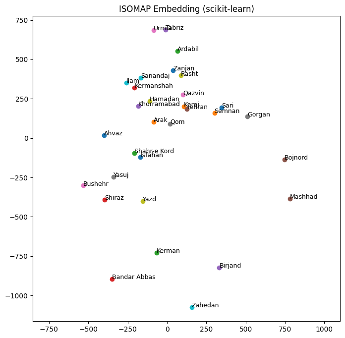

# Isomap for Iranian Cities

A custom implementation of the Isomap pipeline for pairwise distances between Iranian cities, with **classical MDS implemented from scratch** and the resulting embedding validated against `sklearn.manifold.Isomap`.

The notebook constructs a symmetric k-nearest-neighbor graph, computes all-pairs shortest-path distances with SciPy's Floyd-Warshall implementation, and then applies a custom classical MDS implementation based on double-centering and eigendecomposition.

## Results

| Custom implementation | scikit-learn reference |
| --- | --- |
|  |  |

After Procrustes alignment, the custom and scikit-learn embeddings have a disparity of **`6.937449804881e-31`**. This extremely small value indicates that the two aligned embeddings are effectively numerically indistinguishable at the reported precision.

Both methods use the same pairwise distance matrix and `k = 5`, so close agreement is expected if the custom graph construction and MDS stages are consistent with the reference implementation.

## Method

1. Download and load the pairwise city-distance matrix.
2. Retain the five nearest neighbors of each city to form an undirected weighted graph.
3. Compute all-pairs shortest-path distances using SciPy's Floyd-Warshall routine.
4. Apply classical MDS implemented from scratch through double-centering and eigendecomposition.
5. Rotate and reflect the custom embedding for geographic readability.
6. Compare it with scikit-learn using Procrustes analysis.

## Data provenance

The pairwise city-distance matrix was provided by the course teaching assistant as course material. The original data source, collection methodology, and redistribution license were not specified, so this repository does not make any stronger claim about the dataset's provenance.

## Repository contents

- `isomap_iranian_cities.ipynb` - executable implementation, plots, and comparison.
- `custom_isomap.jpg` - final custom Isomap visualization.
- `sklearn_isomap.png` - aligned scikit-learn visualization.
- `requirements.txt` - Python dependencies needed to run the notebook.

## Run locally

Python 3.10 or later is recommended.

```bash
python -m venv .venv
source .venv/bin/activate
python -m pip install -r requirements.txt
jupyter lab isomap_iranian_cities.ipynb
```

Run the notebook from top to bottom. Its first cells download `distances.csv` from the Google Drive file used for the course project; the generated dataset file is ignored by Git.

## Implementation notes

- The k-nearest-neighbor graph construction and classical MDS stages are written explicitly for educational clarity.
- Classical MDS is implemented from scratch; SciPy is used for numerical primitives, including eigendecomposition and the Floyd-Warshall shortest-path routine.
- The custom pipeline checks that the k-nearest-neighbor graph is connected before applying classical MDS.
- The neighborhood size is fixed at `k = 5`, and the target embedding has two dimensions.
- The included notebook retains its saved plot outputs so the results are visible directly on GitHub.
